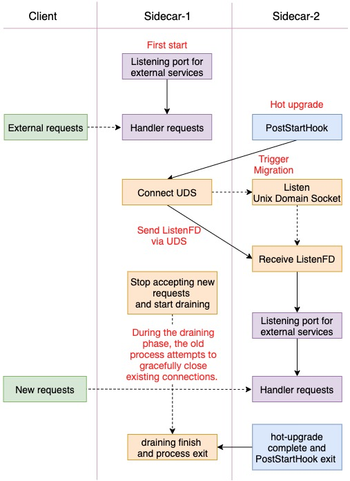

# sidecarset hotupgrade demo
## Migration
The SidecarSet hot upgrade mechanism not only completes the switching of mesh containers and provides a coordination mechanism for old and new versions, but this is only the first step in a long journey. 
The mesh container also needs to provide a PostStartHook script to complete the hot migration of the mesh service itself (the above Migration process), such as Envoy hot restart and Mosn lossless restart.

The migration process of such mesh containers can be summarized as follows: send ListenFD via UDS and stop accepting new requests, start draining. 
For mesh containers that do not support migration you can refer to this process to complete the rebuilding. The logic diagram is as follows:

                             

## Examples
### 1. create sidecarSet
kubectl apply -f config/sidecarset.yaml
```
apiVersion: apps.kruise.io/v1alpha1
kind: SidecarSet
metadata:
  name: hotupgrade-sidecarset
spec:
  selector:
    matchLabels:
      app: hotupgrade
  containers:
    - name: sidecar
      image: openkruise/hotupgrade-sample:sidecarv1
      imagePullPolicy: Always
      lifecycle:
        postStart:
          exec:
            command:
              - /bin/sh
              - /migrate.sh
      upgradeStrategy:
        upgradeType: HotUpgrade
        hotUpgradeEmptyImage: openkruise/hotupgrade-sample:empty
```

### 2. create cloneset and the Pod has been injected with sidecar-1 and sidecar-2 containers
```
// create cloneset
# kubectl apply -f config/cloneset.yaml

# kubectl describe pods busybox-j9h72
Name:         busybox-j9h72
Namespace:    default
Labels:       app=hotupgrade
Annotations:  kruise.io/sidecarset-hash:
                {"hotupgrade-sidecarset":{"updateTimestamp":"2021-06-04T05:44:26Z","hash":"2v7vv4w426v2dw47248f966w4wd2vw9fz872bvvv42cdwz2b8ff689w7v4wb4wz...
              kruise.io/sidecarset-hash-without-image:
                {"hotupgrade-sidecarset":{"updateTimestamp":"2021-06-04T05:44:26Z","hash":"xfc8x5449v668w2662v64c8476c2v772f4658ddcddxf75dwc5zbfbf5bf5wxb5...
              kruise.io/sidecarset-injected-list: hotupgrade-sidecarset
              kruise.io/sidecarset-working-hotupgrade-container: {"sidecar":"sidecar-1"}
              kubernetes.io/psp: ack.privileged
              lifecycle.apps.kruise.io/timestamp: 2021-06-04T05:44:26Z
              version.sidecarset.kruise.io/sidecar-1: 1
              version.sidecarset.kruise.io/sidecar-2: 0
              versionalt.sidecarset.kruise.io/sidecar-1: 0
              versionalt.sidecarset.kruise.io/sidecar-2: 1
Status:       Running
Containers:
  sidecar-1:
    Container ID:   docker://3e792156d727e3f6d77b4b15db2d94efa598bfabd57ab80d9ecaccaef4bfcda0
    Image:          openkruise/hotupgrade-sample:sidecarv1
    Environment:
      IS_INJECTED:             true
      SIDECARSET_VERSION:       (v1:metadata.annotations['version.sidecarset.kruise.io/sidecar-1'])
      SIDECARSET_VERSION_ALT:   (v1:metadata.annotations['versionalt.sidecarset.kruise.io/sidecar-1'])
  sidecar-2:
    Container ID:   docker://ee21bfb0ffd64489e502346c2f5ca3484e45e39218f7f66c5212c2cc2cad86a9
    Image:          openkruise/hotupgrade-sample:empty
    Environment:
      IS_INJECTED:             true
      SIDECARSET_VERSION:       (v1:metadata.annotations['version.sidecarset.kruise.io/sidecar-2'])
      SIDECARSET_VERSION_ALT:   (v1:metadata.annotations['versionalt.sidecarset.kruise.io/sidecar-2'])
  busybox:
    Container ID:   docker://14ce4ea40e5ef864db75c6b4ad3febc6b11e4a1d992eb9078d943baac7d28b42
    Image:          openkruise/hotupgrade-sample:busybox
```

### 4. busybox requests the sidecar(version=v1) service once every 100 milliseconds
```
# kubectl logs busybox-j9h72 busybox
I0604 05:23:53.345239       1 main.go:39] request sidecar server success, and response(body=This is version(v1) sidecar)
I0604 05:23:53.455792       1 main.go:39] request sidecar server success, and response(body=This is version(v1) sidecar)
I0604 05:23:53.566292       1 main.go:39] request sidecar server success, and response(body=This is version(v1) sidecar)
I0604 05:23:53.676816       1 main.go:39] request sidecar server success, and response(body=This is version(v1) sidecar)
I0604 05:23:53.787334       1 main.go:39] request sidecar server success, and response(body=This is version(v1) sidecar)
I0604 05:23:53.897849       1 main.go:39] request sidecar server success, and response(body=This is version(v1) sidecar)
```

### 5. upgrade sidecar container, image=openkruise/hotupgrade-sample:sidecarv2
```
 //edit sidecarset.yaml and changed image=openkruise/hotupgrade-sample:sidecarv2
# kubectl apply -f config/sidecarset.yaml

# kubectl get pods busybox-j9h72
NAME              READY   STATUS              RESTARTS   AGE
busybox-j9h72     1/1     Running             1          6d21h

# kubectl describe pods busybox-j9h72
Events:
  Type    Reason     Age                 Message
  ----    ------     ----                -------
  Normal  Killing    5m47s               Container sidecar-2 definition changed, will be restarted
  Normal  Pulling    5m17s               Pulling image "openkruise/hotupgrade-sample:sidecarv2"
  Normal  Created    5m5s (x2 over 12m)  Created container sidecar-2
  Normal  Started    5m5s (x2 over 12m)  Started container sidecar-2
  Normal  Pulled     5m5s                Successfully pulled image "openkruise/hotupgrade-sample:sidecarv2"
```

### 6. busybox continuously requests the sidecar service and there are no failed requests
```
# kubectl logs busybox-j9h72 busybox
I0604 05:53:40.725662       1 main.go:39] request sidecar server success, and response(body=This is version(v1) sidecar)
I0604 05:53:40.836212       1 main.go:39] request sidecar server success, and response(body=This is version(v1) sidecar)
I0604 05:53:40.946739       1 main.go:39] request sidecar server success, and response(body=This is version(v1) sidecar)
I0604 05:53:41.057366       1 main.go:39] request sidecar server success, and response(body=This is version(v2) sidecar)
I0604 05:53:41.167977       1 main.go:39] request sidecar server success, and response(body=This is version(v2) sidecar)
I0604 05:53:41.278621       1 main.go:39] request sidecar server success, and response(body=This is version(v2) sidecar)
```
